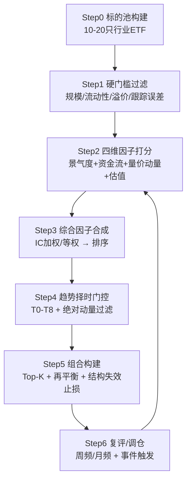

# 行业 ETF 选股算法 · 标准作业程序（SOP）

> **版本**：v1.0 · 生成日期 2026-08-14
> **适用**：个人中长期投资（3–5 年）· 本金规模 ¥15,000（`portfolio_value=15000`）
> **定位**：可工程化落地的行业 ETF 量化选股流程，接入现有 **T0–T8 趋势状态机 + 五层门控 + 三道程序校验 + 结构失效位** 框架
> **免责**：本文为量化算法/方法论 SOP，**不构成任何投资建议**。因子模型基于历史规律构建，存在市场环境变化时的失效风险。

---

## 目录

1. [整体架构](#一整体架构筛选--合成--择时--门控)
2. [Step 0-1 标的池与硬门槛](#二step-0-1标的池与硬门槛能买好买买得值)
3. [Step 2 四维因子打分](#三step-2四维因子打分算法核心)
4. [Step 3 综合因子合成与排序](#四step-3综合因子合成与排序)
5. [Step 4 趋势择时门控](#五step-4趋势择时门控t0t8--绝对动量过滤)
6. [Step 5 组合构建与执行](#六step-5组合构建与执行)
7. [程序校验规则](#七程序校验规则三道程序校验)
8. [算法伪代码](#八算法伪代码)
9. [参数配置速查表](#九参数配置速查表)
10. [避坑清单](#十避坑清单)
11. [复评与调仓周期](#十一复评与调仓周期)

---

## 一、整体架构：筛选 → 合成 → 择时 → 门控

主流行业轮动策略本质是「**筛选-合成-验证**」闭环：每个调仓日筛出未来具备超额收益潜力的行业，等权或加权配置。结合本地框架，完整算法分五步：



**核心分工**：
- **选股算法**（Step 1–3）负责「**选谁**」
- **趋势门控**（Step 4–5）负责「**能不能买**」
- 二者**解耦**——即便综合因子分高，趋势状态不允许也禁止建仓

---

## 二、Step 0-1：标的池与硬门槛（能买、好买、买得值）

行业 ETF 先过三条硬门槛，把不合格标的一次性剔除。

| 门槛 | 阈值建议 | 目的 |
|---|---|---|
| **规模 AUM** | > 5–10 亿元 | 避免清盘 / 流动性风险 |
| **日均成交额** | 稳居市场前列、大单不滑点 | 调仓时"一键换车"不卡壳 |
| **折溢价率** | 近 1 月均值 ≤ ±0.15% | 不买贵、不贱卖，压低冲击成本 |
| **跟踪误差 & 费率** | 越小越好、管理费尽量低 | 长期复利不被侵蚀 |
| **复制方法** | 全复制优先 > 抽样 | 减少跟踪偏离 |

**标的池规模**：建议 **10–20 只**，覆盖周期、消费、科技、金融、医药等大方向。现有黄金 / 军工 / 粮食三只纳入池中统一打分。

**当前持仓映射**（示例）：

| ETF | 代码 | 资产类别 | 主题 | 当前趋势状态 |
|---|---|---|---|---|
| 军工龙头 ETF 富国 | sh512710 | equity_sector_etf | military_industry | **T0** 长期下降 |
| 粮食 ETF 鹏华 | sz159698 | equity_sector_etf | grain_industry | **T0** 长期下降 |
| 黄金 ETF 华安 | sh518880 | commodity_futures_etf | gold | **T1** 下降减速 |

---

## 三、Step 2：四维因子打分（算法核心）

券商主流做法：从**基本面景气度、量价动量、资金流强度、估值差**四维提因子。综合因子全区间 **IC 均值 12.54%**、ICIR 50.92%，高景气组年化 **17.84%**。

### 因子 1：景气度（核心维度，权重最大）

不只看 ROE / 利润增速方向，拆三层：

| 层级 | 观察指标 | 阈值 / 信号 |
|---|---|---|
| **高频验证** | 月度行业 PPI 环比、周度开工率、日度现货价 | 提前预判季报方向；若现货环比跌破关键线，即便 PE 低也暂不介入 |
| **预期差（核心催化剂）** | 卖方盈利预测上调 / 下调家数比 | 连续 3 周 > 1.5 → 景气正被重新定价（领先股价 1–2 周） |
| **库存位置** | 产成品库存 + 营收增速 | 仅"**主动补库**"阶段给满仓权重 |

### 因子 2：量价动量（推荐"斜率 × R²"）

简单涨幅排序易过拟合，进阶做法是**趋势速度 × 趋势确定性**：

$$动量分 = 年化收益率斜率(s) \times R^2$$

- 对过去 N 日**对数价格**做线性回归
- 斜率 `s`：反映"涨得快"（收益动能）
- `R²`（拟合优度）：反映"涨得真"（趋势平滑度）；R²→1 又稳又强，R²→0 噪音多、直接打折剔除
- **回望窗口 N**：20 / 40 / 60 日（约 1–3 个月），A 股行业动量偏短期

### 因子 3：资金流强度

拆解资金属性，区分"配置盘（稳定器）"与"交易盘（放大器）"：

| 资金类型 | 信号 | 权重方向 |
|---|---|---|
| 主动**超大单**净流入 | 机构抢筹的知情交易信号 | 正向 |
| **小单**资金流 | 个人投资者活跃度 | 反向指标 |
| **资金共识度** | 前五大主力（北向/公募/私募/两融/产业资本）≥4 家同向净买入 | 趋势可持续性极强 |

### 因子 4：估值差（安全边际 + 失效边界）

用**跨行业 Z-score** 而非绝对估值：

$$Z = \frac{行业PE - 全市场PE中位数}{标准差}$$

| Z-score | 判定 | 动作 |
|---|---|---|
| Z > 2 | 显著高估 | 预警撤退区 |
| −1.5 ≤ Z ≤ 2 | 合理 | 正常 |
| Z < −1.5 | 显著低估 | 布局区 |

**确定性撤退信号**：`PEG > 2` 且 `Z > 2` **同时超限**。

> **本地轻量实现**：操作卡里的 **250 日位置锚**（1 年区间位置判断估值高低）即估值维度的量化实现。

---

## 四、Step 3：综合因子合成与排序

**合成方法**（券商标准做法）：

1. 单一维度内以 **IC 胜率为权重**构建复合因子
2. 四大维度**等权整合**为综合行业轮动因子
3. 按综合因子对全池 ETF 排序

**宏观情景下的动态赋权**（比等权更进阶）：

| 宏观情景 | 景气度 | 估值差 | 资金流 | 动量差 | 核心策略 |
|---|---|---|---|---|---|
| 复苏期（PMI>50） | 40% | 20% | 20% | 20% | 重仓顺周期 |
| 衰退期（PMI<48） | 10% | 40% | 30% | 20% | 防御 + 低估反转 |
| 流动性宽松（DR007↓） | 20% | 10% | 50% | 20% | 跟随主力资金 |
| 震荡混沌期 | 20% | 20% | 20% | 40% | 轻仓短频动量 |

**核心纪律**：
- 景气度与资金流冲突时 → **以景气度为准**（资金可能犯错，产业趋势极少短期逆转）
- 估值与动量同时报警 → **无条件减仓**（确定性最高的防守信号）

---

## 五、Step 4：趋势择时门控（T0–T8 + 绝对动量过滤）

纯截面动量在震荡/熊市里会"高位接盘"放大回撤，必须叠加择时过滤。这一步是本地框架最强的地方——**趋势状态决定动作合法性**。

### 通用做法（业界）

| 方法 | 逻辑 |
|---|---|
| **绝对动量 / 大盘过滤** | ETF 或沪深300 跌破 MA200 / 均线斜率转负 → 切换防御资产（债券ETF）或持币 |
| **RSRS 择时** | 最高价 vs 最低价回归的 β 值标准化，score = Z × R²，> 0.7 买入、< −0.7 清仓 |
| **RRG 相对旋转图** | 配置处于"领先/改善"象限（RS-Ratio>100）的行业，年化超额显著 |

### 映射到 T0–T8 门控

| 状态 | 含义 | 允许动作 |
|---|---|---|
| **T0** 长期下降 | 周线向下 + 空头排列 + 低点降低 | **禁止**加仓/补仓/追高，只减仓 |
| **T1** 下降减速 | 周线向下但日线减速/反弹，未确认反转 | 持有观察，禁止新增 |
| **T3b** 反转确认 | 周线转上 + MA60 转上 | 才可分批增加核心仓 |
| **T8** 完整趋势走坏 | 完整周线破位 | 退出核心仓 |

**建仓门控清单**（每笔加仓前逐条过一遍）：

- [ ] 基本面是否恶化？（恶化则任何加仓都是扩大错误）
- [ ] 价格是否进入**预先划定的低估区间**，而非凭感觉抄底？
- [ ] 趋势状态是否允许加仓？（**T0/T1 禁止新增**，需 T3b 才可分批增加）
- [ ] 总仓位是否留有上限与现金？（建议 ≤ 计划资金的 2/3–90%）
- [ ] 是否已在**首次买入前**设定结构失效位 / 止损线？

---

## 六、Step 5：组合构建与执行

| 参数 | 建议 |
|---|---|
| **持仓数量** | 进攻型 Top 1–2；稳健型 Top 3–5 等权（收益与风险折中） |
| **调仓频率** | 行业/主题：周频或半月频；宽基：月频 |
| **轮动阈值** | 设最小动量差阈值，避免微小差异频繁调仓、抬高换手 |
| **单只上限** | 单行业 ETF ≤ 5%–15%（波动远大于宽基） |
| **止损** | 结构失效位 = 结构支撑 − 0.5×ATR20，收盘破位且持续确认则降仓 |
| **灾难保护位** | 结构支撑 − 1×ATR20，单日收盘跌破 → 退出剩余核心仓 |
| **空仓机制** | 若无 ETF 满足正动量 + 趋势过滤 → 持币或转债券ETF |

### 结构失效位计算示例（基于本地操作卡）

| ETF | 结构支撑（60/120日低） | ATR20 | 结构失效位 = 支撑 − 0.5×ATR20 |
|---|---|---|---|
| 军工 sh512710 | 0.580 | 0.0153 | ≈ **0.572** |
| 粮食 sz159698 | 0.810 | 0.0204 | ≈ **0.800** |
| 黄金 sh518880 | 8.220 | 0.1278 | ≈ **8.156** |

---

## 七、程序校验规则（三道程序校验）

每个动作提交前，机器强制校验动作合法性（拒绝非法组合）：

```
校验 1（趋势-动作合法性）：
    T0 + ADD           => 拒绝
    T0 + AVERAGE_DOWN  => 拒绝
    T0 + CHASE         => 拒绝
    T1 + ADD           => 拒绝
    T1 + AVERAGE_DOWN  => 拒绝

校验 2（仓位上限）：
    单只 ETF 仓位 > 单只上限（15%）   => 拒绝
    总仓位 > portfolio_value × 90%    => 拒绝

校验 3（止损前置）：
    首次买入前未设定结构失效位/止损线 => 拒绝
```

**禁止动作清单**（下降趋势中）：
- ❌ 不因形态分高（如 bowl 68 分）而左侧抄底（趋势仍是 T0）
- ❌ 不在下降趋势中摊低加仓
- ❌ 不把当前反弹当作趋势反转重仓
- ❌ 不因新闻/事件加仓

---

## 八、算法伪代码

```python
def sector_etf_selection(etf_pool, date, portfolio_value=15000):
    # ---------- Step1 硬门槛过滤 ----------
    pool = [e for e in etf_pool
            if e.aum > 5e8
            and e.avg_turnover_ok
            and abs(e.premium) <= 0.0015
            and e.tracking_error_ok]

    # ---------- Step2 四维因子打分（各因子截面标准化 zscore） ----------
    for e in pool:
        e.f_prosper = score_prosperity(e)          # 景气度：PPI/预期差/库存
        e.f_mom     = slope(e, N=20) * r2(e, N=20)  # 量价动量：斜率×R²
        e.f_flow    = big_order_netflow_z(e)        # 资金流：主动超大单
        e.f_val     = -cross_industry_pe_z(e)       # 估值差：低估为正

    # ---------- Step3 综合合成（宏观情景动态赋权） ----------
    w = macro_weights(pmi=get_pmi(date), dr007=get_dr007(date))
    for e in pool:
        e.score = (w.prosper * e.f_prosper
                   + w.val   * e.f_val
                   + w.flow  * e.f_flow
                   + w.mom   * e.f_mom)

    ranked = sorted(pool, key=lambda x: x.score, reverse=True)

    # ---------- Step4 趋势门控（T0-T8 + 绝对动量过滤） ----------
    candidates = []
    for e in ranked:
        # 只买右侧确认；T0/T1 禁止新增
        if e.trend_state not in ("T3", "T3b", "T4"):
            continue
        if e.mom <= 0:                 # 绝对动量为负则剔除
            continue
        if not market_above_ma200():   # 大盘过滤
            continue
        # 三道程序校验
        if not program_check(e.trend_state, action="ADD"):
            continue
        candidates.append(e)

    # ---------- Step5 组合构建：Top-K，无合格标的则持币 ----------
    K = 3  # 稳健型
    if not candidates:
        return ["CASH / BOND_ETF"]
    selected = candidates[:K]
    for e in selected:
        e.target_weight = min(0.15, 1.0 / K)      # 单只上限 15%
        e.stop_loss = e.structure_support - 0.5 * e.atr20  # 结构失效位
    return selected
```

---

## 九、参数配置速查表

| 模块 | 参数 | 默认值 |
|---|---|---|
| **标的池** | 数量 | 10–20 只 |
| 硬门槛 | AUM | > 5 亿 |
| 硬门槛 | 折溢价率 | ≤ ±0.15% |
| **动量因子** | 回望窗口 N | 20 / 40 / 60 日 |
| 动量因子 | 打分公式 | 斜率 × R² |
| **估值因子** | 高估阈值 | Z > 2 |
| 估值因子 | 低估阈值 | Z < −1.5 |
| **资金流** | 共识家数 | ≥ 4 家同向 |
| **组合** | 持仓数 K | 进攻 1–2 / 稳健 3–5 |
| 组合 | 单只上限 | 5%–15% |
| 组合 | 调仓频率 | 周频 / 半月频 |
| **风控** | 结构失效位 | 支撑 − 0.5×ATR20 |
| 风控 | 灾难保护位 | 支撑 − 1×ATR20 |
| 风控 | 回撤容忍 | 15%（进取配置） |
| 风控 | 风险预算 | 0.8%（进取配置） |
| **组合口径** | portfolio_value | 15000 |

---

## 十、避坑清单

- ❌ **机械套用固定比例**：不同行业波动特征差异大，应按标的特性动态调整批次和数量
- ❌ **在 T0/T1 下降趋势里左侧硬抄、机械摊平**：单边下跌会迅速耗尽资金
- ❌ **只有卫星、没有核心**：组合波动被单一行业放大（当前黄金/军工/粮食即偏此状态，缺宽基底仓）
- ❌ **卫星持仓过多（>8 只）**：与核心分散效果重叠、管理成本上升
- ❌ **用倒金字塔（越涨越买多）追高**：趋势反转时高位重仓迅速侵蚀利润
- ❌ **把短期热点当长期赛道**：卫星要选有长期逻辑的方向（老龄化→医药、碳中和→新能源）
- ❌ **溢价买入**：场内买入溢价过高会降低预期回报
- ❌ **忽视跟踪误差**：长期下管理费 + 跟踪误差会吞噬收益

---

## 十一、复评与调仓周期

| 类型 | 触发条件 |
|---|---|
| **定期** | 周五收盘后（完整周线形成后重新计算），或月度 |
| **价格** | 触及结构失效位 / 反弹压力位 |
| **趋势** | 周线转上、MA60 转上（T0/T1 → T3b） |
| **事件** | 行业订单/政策落地、财报催化、宏观利率/汇率突变 |

**再平衡规则**：
- 以**偏离幅度**为触发（如卫星占比偏离原定 ±5 个百分点），而非固定时间
- 卫星部分因大涨占比超上限 → 卖出超额买入核心；因大跌占比过低 → 从核心转移资金补仓
- 这种"低买高卖"的纪律性操作，自动控制风险并锁定部分收益

---

## 附：一句话总结

> **硬门槛过滤 → 景气度(核心)+动量(斜率×R²)+资金流+估值差 四维打分 → 宏观情景动态赋权合成排序 → T0–T8 趋势门控（右侧才买，T0/T1 禁买）→ Top-K 等权 + 结构失效止损 + 无合格标的则持币。**
>
> 其中**选股算法负责"选谁"，趋势门控负责"能不能买"**，二者解耦。

---

*数据来源：券商行业轮动多因子研究（国泰海通 ETF 配置系列）+ 本地操作卡框架（T0–T8 状态机 / portfolio_config.json）· 生成 2026-08-14 · 不构成投资建议*
